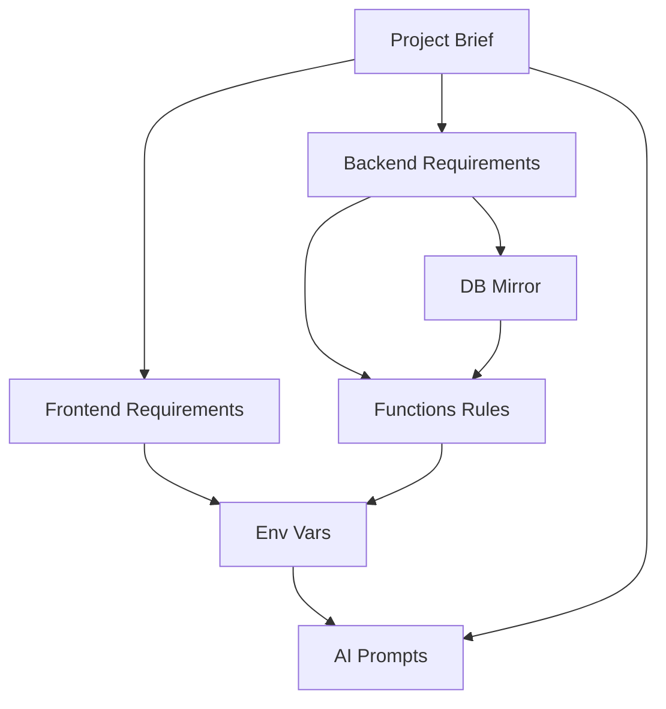

# AI-Friendly Documentation System

Esta carpeta es la fuente unica de verdad para agentes AI (VS Code agents, Copilot, etc.) para construir y mantener este proyecto full-stack.

## Stack tecnologico

- Frontend: React + Vite + PWA + TailwindCSS + Motion + Lucide Icons
- Backend: Appwrite (Auth, Databases, Storage, Functions, Sites)

Si algo no esta documentado aqui, los agentes NO deben asumirlo como requerido.

## Orden de lectura (OBLIGATORIO)

1. 00_project_brief.md
2. 01_frontend_requirements.md
3. 02_backend_appwrite_requirements.md
4. 03_appwrite_db_mirror.md
5. 04_appwrite_functions_rules.md
6. 05_environment_variables.md
7. 06_ai_prompts.md

## Reglas de commit

- Si cambias arquitectura frontend, actualiza 01_frontend_requirements.md
- Si cambias schema de Appwrite, actualiza 03_appwrite_db_mirror.md
- Si agregas/actualizas variables de entorno, actualiza 05_environment_variables.md
- Si agregas/actualizas functions, incluye README.md + .env.example en la carpeta y actualiza 04_appwrite_functions_rules.md si cambian los patrones

## Politica de lenguaje

Reglas:

- Ingles para instrucciones tecnicas: requisitos, arquitectura, restricciones, pasos
- Espanol permitido para contexto de negocio: descripcion del producto, historias de usuario, requisitos de UI copy (especialmente en 00_project_brief.md)
- Siempre ingles para identificadores de codigo:
  - IDs de colecciones, claves de atributos, nombres de componentes, nombres de rutas, claves de variables de entorno, nombres de funciones
- Mantener identificadores ASCII-only y consistentes

## Que significa "fuente de verdad"

- 03_appwrite_db_mirror.md DEBE reflejar la consola de Appwrite:
  - databaseId, buckets, collections, attributes, constraints, indexes
- 05_environment_variables.md es el contrato canonico de nombres de variables
- Si el schema backend cambia, actualizar el mirror primero (o al mismo tiempo)

## Diagrama de relacion entre documentos

## Estructura de repositorio esperada

Fuera de /documentation, el repositorio debe incluir:

- /src para codigo frontend
- /functions para Appwrite Functions
- /public para assets PWA (manifest, icons)
