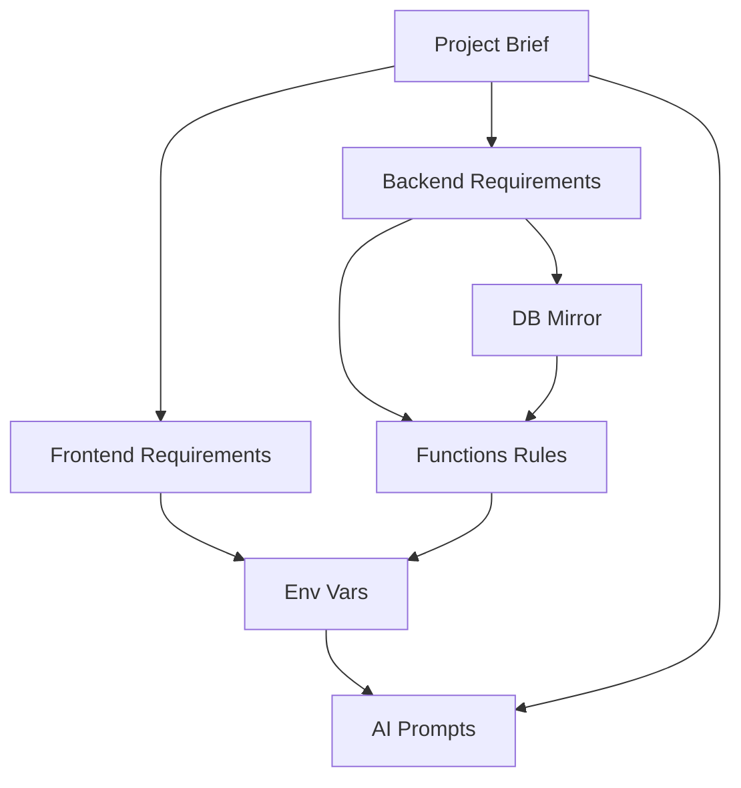

# Comprehensive Prompt and Documentation System for React Vite PWA and Appwrite

## Research findings and decisions

A strong “base prompt” system isn’t just a single prompt—it’s a **documentation contract** that forces any AI agent to (a) read requirements, (b) follow non‑negotiable constraints, and (c) keep a **single, always-updated mirror** of the backend schema. This is especially important for PWA + Appwrite projects because the “hidden complexity” (service worker caching rules, schema constraints, scopes/keys) is where agents tend to hallucinate or drift.

For the frontend PWA layer, the most agent-friendly default on Vite remains **vite-plugin-pwa** because it is designed as a **framework-agnostic**, “zero-config” PWA integration that generates a manifest/service worker and exposes Workbox configuration when you need control. citeturn4search3turn4search7 A key operational detail: the plugin can error or fail precache completeness if assets exceed Workbox’s default file-size threshold; the plugin docs explicitly call out the `maximumFileSizeToCacheInBytes` issue and the default size limit behavior. citeturn0search6turn0search2 For teams who need service worker behavior in development, the plugin also documents a dev-mode option (`devOptions.enabled`) that changes how SW logic is made available during development. citeturn4search6

For theming and dark mode, Tailwind’s official guidance supports the **class strategy**—i.e., toggling a `dark` class on the HTML tree and persisting preference (often in localStorage). citeturn0search3turn0search11 Tailwind v4’s direction also leans more heavily into CSS-driven configuration (e.g., theme variables via `@theme`), which aligns well with your preference for a tokenized design system using CSS variables. citeturn6search3turn6search6

For animation, **Motion** explicitly supports React and Vite “out of the box” and documents React version compatibility requirements (React 19.2.4). citeturn0search4turn0search18 For “theme switch” animation, `react-theme-switch-animation` is explicitly positioned as a smooth theme switching solution built on the View Transition API (implementation detail that is useful for agents when integrating). citeturn6search1turn6search0

On Appwrite, the “rules-based schema” you described map tightly to Appwrite’s own constraints: the models/API references repeatedly state that a **default cannot be set when an attribute is required**, and string attributes have an explicit `size` limit. citeturn1search9turn1search1 Appwrite also supports multiple authentication methods (email/password, phone/SMS, magic URL, email OTP, OAuth2, anonymous sessions, and more), which is why a consistent “Auth + Profile mirror” is a good architectural constant across projects. citeturn1search8turn1search12turn1search4

Two Appwrite operational points heavily influence your documentation system:

- **Storage limit baseline**: self-hosted Appwrite’s single-file upload limit defaults to 30 MB and is controlled by `_APP_STORAGE_LIMIT`, meaning your “<30MB” rule is aligned with the default server limit. citeturn1search3turn1search11turn1search7
- **Indexes as performance contract**: Appwrite recommends an index for every column (attribute) you query, including composite indexes for multi-column queries. This is essential for an AI agent that will generate query code—your docs should force the agent to declare indexes up front. citeturn2search3turn2search15

Finally, your policy of avoiding relationship attributes is defensible from an “agent reliability” standpoint: Appwrite documents relationships and how to create them, but also indicates (in legacy/older relationship docs) that relationships can be treated as experimental and subject to change; additionally, community discussions highlight limitations such as relationship-query support. This strengthens the rationale for using scalar foreign keys. citeturn2search1turn2search5turn2search13

## Language strategy for AI agents and Spanish-first products

Your question—**should the docs be in English or Spanish**—is best solved by separating _what the agent executes_ from _what you/clients read_.

A practical and evidence-based default is:

- **English for technical instructions** (rules, constraints, architecture decisions, “MUST/SHOULD” directives). One major coding assistant’s docs explicitly state that its chat experience is primarily supported in English, which strongly suggests English yields more consistent agent behavior across tools. citeturn3search15
- **Spanish for business context and UI copy** (project brief narrative, user stories, tone/voice notes).
- **Always English for code identifiers** (env var keys, collection IDs, attribute keys, component names, routes). This is also a common best practice in developer collaboration contexts because naming consistency and searchability matter across teams and ecosystems. citeturn3search2

This hybrid approach creates the most stable outcome for AI agents: the agent reads deterministic English constraints, while you keep Spanish context where it matters.

## System architecture and contracts

The delivered system is built around three “contracts” that remove ambiguity for agents:

The environment-variable contract: Vite only exposes env vars to client code under a prefix (default `VITE_`) and warns that exposing everything is a security risk. citeturn0search1turn0search13turn0search16 Therefore, the safest long-term approach is:

- All non-secret config is `VITE_*` so it can be used by frontend and functions.
- All secrets are **non-`VITE_`** and remain functions-only.

The schema contract: Appwrite enforces a set of attribute rules (notably: default cannot be set when required; strings have size), so your schema template forces those constraints explicitly and pushes “min-length” business validation to the frontend/functions validation layer when Appwrite cannot enforce it natively. citeturn1search9turn1search1

The functions contract: Appwrite functions are meant to be configured with scopes and can use **dynamic API keys**, where best practice is least privilege. This is explicitly described in Appwrite’s functions documentation. citeturn1search2turn2search14 The template also aligns with Appwrite’s documented request/response handler style for Node. citeturn7search3

A small UX contract is embedded too: Apple’s HIG guidance for touch targets (44×44pt) provides an objective baseline for mobile-first UI polish. citeturn5search6turn5search10

## Template pack manifest

This is the exact folder structure included in the downloadable ZIP (and printed below as separate documents):

```txt
react-vite-pwa-appwrite-ai-pack/
├── documentation/
│   ├── 00_project_brief.md
│   ├── 01_frontend_requirements.md
│   ├── 02_backend_appwrite_requirements.md
│   ├── 03_appwrite_db_mirror.md
│   ├── 04_appwrite_functions_rules.md
│   ├── 05_environment_variables.md
│   ├── 06_ai_prompts.md
│   └── README.md
├── functions/
│   └── _template/
│       ├── src/
│       │   └── main.js
│       ├── .env.example
│       ├── README.md
│       └── package.json
└── README.md
```

PWA decision summary (why vite-plugin-pwa remains the default):

| Option                                | When it’s best                   | Main benefit                                  | Main risk                                                                                                |
| ------------------------------------- | -------------------------------- | --------------------------------------------- | -------------------------------------------------------------------------------------------------------- |
| vite-plugin-pwa (default)             | Most Vite PWAs                   | Fast setup, Workbox integration, configurable | Must manage caching/update UX; beware file-size precache thresholds citeturn4search3turn0search6     |
| Manual service worker + Workbox       | Advanced/custom caching rules    | Full control, fewer abstractions              | Higher complexity; more agent drift risk; requires deeper SW expertise citeturn5search16turn5search4 |
| Manual service worker without Workbox | Very small apps or special cases | Minimal dependencies                          | Easy to make caching mistakes; maintenance cost citeturn5search16turn5search4                        |

This pack also explicitly reinforces PWA fundamentals: PWAs commonly rely on a manifest + HTTPS + icon requirements for installability, and service workers power offline/background behavior. citeturn5search1turn5search9turn5search0

Atomic design appears because it is a proven method to enforce modular component breakdown (atoms → molecules → organisms → templates → pages), which directly supports your “no spaghetti / no massive files” rule. citeturn5search3turn5search15

## Template files

**File: `README.md`**

```md
# React + Vite PWA + Appwrite — AI Prompt & Documentation Pack

This pack provides a modular documentation system and reusable prompt starters for AI-assisted development.

It is meant to be copied into any new repository and used as the foundation for:

- Frontend architecture and UX constraints
- Appwrite schema conventions and DB mirror
- Appwrite Functions structure and env var standards
- AI prompt starters for consistent outputs

Start here:

- documentation/README.md
- documentation/00_project_brief.md
```

**File: `documentation/README.md`**

````md
# AI-Friendly Documentation System

This folder is designed to be the single source of truth for AI agents (VS Code agents, Antigravity, etc.) to build and maintain full-stack projects using:

- Frontend: React + Vite + PWA + TailwindCSS + Motion
- Backend: Appwrite (Auth, Databases, Storage, Functions, Sites)

If something is not written here, agents must not assume it is required.

## How an AI agent should use this folder

Read order (MUST follow):

- 00_project_brief.md
- 01_frontend_requirements.md
- 02_backend_appwrite_requirements.md
- 03_appwrite_db_mirror.md
- 04_appwrite_functions_rules.md
- 05_environment_variables.md
- 06_ai_prompts.md

Commit rule:

- If you change frontend architecture, update 01_frontend_requirements.md.
- If you change Appwrite schema, update 03_appwrite_db_mirror.md.
- If you add/update env vars, update 05_environment_variables.md.
- If you add/update functions, include README.md + .env.example in the function folder and update 04_appwrite_functions_rules.md if patterns change.

## Language policy (recommended)

Why this matters: AI agents generally perform best when technical instructions are in English, but your projects can still be Spanish-first for product content.

Rules:

- English for technical instructions: requirements, architecture, constraints, steps.
- Spanish is allowed for business context: product description, user stories, UI copy requirements (especially in 00_project_brief.md).
- Always English for code identifiers:
  - Collection IDs, attribute keys, component names, route names, environment variable keys, function names.
- Keep identifiers ASCII-only and consistent.

## What “source of truth” means

- 03_appwrite_db_mirror.md MUST mirror the Appwrite Console:
  - databaseId, buckets, collections, attributes, constraints, indexes
- 05_environment_variables.md is the canonical env var naming contract.
- If backend schema changes, update the mirror first (or at the same time).

## Quickstart for a new project

1. Copy this pack into the new repository.
2. Fill 00_project_brief.md (Spanish allowed in narrative).
3. Define the first version of backend schema in 03_appwrite_db_mirror.md.
4. Configure Appwrite:
   - Create project, database, collections, attributes, indexes, buckets (per mirror)
   - Configure Auth providers (per brief)
5. Configure environments:
   - Frontend .env from 05_environment_variables.md
   - Function variables per function .env.example
6. Use documentation/06_ai_prompts.md "Master kickoff prompt" to bootstrap the repo.

## Diagram: how the documents relate


````

## Repo structure expectations

Outside /documentation, a typical repository should include:

- /src for frontend code
- /functions for Appwrite Functions
- Optional /scripts for small helpers (avoid redundancy)

````

**File: `documentation/00_project_brief.md`**
```md
# Project Brief

This file is filled by the project owner (you). It defines what to build and what not to build.
AI agents MUST treat this file as authoritative and MUST NOT invent requirements.

## Project identity

- Project name:
- Repo name:
- App category: (education / productivity / finance / etc.)
- Short product description (Spanish allowed):
- Target users:
- Primary devices: mobile-first (default) / desktop-first
- Timezone default: America/Mexico_City

## Success criteria

Define what “done” means:
- Must-have features:
- Must-have pages:
- Must-have integrations:
- Out of scope (explicitly):

## Non-negotiables

- Premium UI (no generic template look).
- Mobile-first + fully responsive.
- Safe-area aware layout (top/bottom bars).
- Micro-interactions and transitions that feel intentional.
- Modular code; no spaghetti; avoid long files.
- Appwrite schema rules MUST be followed (see backend requirements).

## Users, roles, and permissions

- Guest access allowed? (yes/no)
- Roles needed? (yes/no)
  - If yes, list roles and permissions:
    - role:
    - can read:
    - can write:
- Multi-tenant (groups/workspaces)? (yes/no)

## Language and i18n

- Default language: Spanish
- UI copy style: formal / casual / friendly / professional
- i18n needed? (yes/no)
  - If yes:
    - Supported locales:
    - Default locale:
    - Who writes translations:

## Frontend scope

PWA:
- PWA required? (yes/no)
- Install prompt UX required? (yes/no)
- Offline support required? (yes/no)
  - If yes, list offline-critical flows and screens:

Theming:
- Dark mode required? (yes/no)
- Default theme: system / light / dark
- Theme switch animation required? (yes/no)

Routing:
List the routes (minimum). Example:
- /
- /auth/login
- /auth/register
- /app
- /app/settings

Data:
- Real-time required? (yes/no)
- Cached queries required? (yes/no)
- Persistence required (offline cache)? (yes/no)

## Backend scope (Appwrite)

- Appwrite endpoint (example: https://appwrite.racoondevs.com):
- Appwrite project ID:
- Database ID:
- Buckets needed:
  - avatars (yes/no)
  - publicFiles (yes/no)
  - privateFiles (yes/no)

Auth:
- Auth methods:
  - Email/password
  - Phone/SMS
  - Email OTP / Magic URL
  - OAuth2 providers (list)
- Verification rules:
  - Use Appwrite verification? (yes/no)
  - Custom verification workflow? (yes/no) — explain

Mandatory collections (always present):
- profiles
- userPreferences

Optional collections:
- groups (if multi-tenant)
- groupMembers (if groups)

Domain collections:
List domain entities you need. For each:
- entity name (collectionId in camelCase):
- owner model: profileId / groupId
- must-have fields:
- must-have queries (filters/sorts):
- soft delete? (enabled=true) yes/no
- important validations:

## Appwrite Functions

List the functions needed. For each function:
- Name (folder name):
- Purpose (Spanish allowed, but keep technical details English)
- Trigger type: event / cron / manual
- Trigger config (event names or cron expression):
- Scopes needed (least privilege):
- Collections/buckets touched:
- Inputs and outputs:

## Non-functional requirements

- Performance:
  - target LCP:
  - target bundle size:
- Security:
  - secrets handling requirements:
- Observability:
  - logging requirements:

## Deliverables and documentation upkeep

Agent MUST keep these in sync:
- 03_appwrite_db_mirror.md mirrors Appwrite Console.
- Every function folder has README.md + .env.example.
- Any new env var must be added to 05_environment_variables.md.
````

**File: `documentation/01_frontend_requirements.md`**

```md
# Frontend Requirements and Architecture

AI agents MUST follow these rules unless 00_project_brief.md explicitly overrides them.

## Default stack

- React (JavaScript + JSDoc; no TypeScript by default)
- Vite
- PWA: vite-plugin-pwa (Workbox-based service worker generation)
- CSS: TailwindCSS v4.x
- Theming: Tailwind dark variant + class strategy
- Theme switch animation (optional): react-theme-switch-animation
- Animations: Motion (`motion`) as default; Framer Motion only as fallback
- Routing: react-router-dom (default)
- Data fetching/caching: TanStack React Query (recommended)

## PWA requirements

Core PWA deliverables:

- Web manifest: name, short_name, icons, theme_color, background_color, display, start_url
- Service worker registration and update strategy
- Offline strategy (defined in 00_project_brief.md)

Update UX (recommended baseline):

- registerType: autoUpdate
- When a new SW is installed:
  - show a subtle “Update available” toast/button
  - allow user to refresh to activate the new SW

Development:

- Service worker in dev is optional (many teams disable to avoid caching confusion).
- If enabled, document how to “reset” SW and caches.

Workbox size limits:

- If some built assets disappear from the precache list, check Workbox file size thresholds.
- Adjust maximumFileSizeToCacheInBytes only when needed.

Caching strategies (pick per resource type; document choices):

- App shell assets: precache
- API: usually network-first with short TTL, or stale-while-revalidate (depends on app)
- Images: cache-first with expiration
- Offline fallback: show a friendly offline UI

## UI quality bar

- Mobile-first layout and typography.
- Premium aesthetics: gradients, depth, glassmorphism (when appropriate), clean spacing.
- Micro-interactions:
  - hover / press states
  - subtle transitions between state changes
  - loading skeletons, empty states, error states
- Safe-area aware layout:
  - use `env(safe-area-inset-top)` / bottom in app shell if needed.

Touch target guideline:

- Aim for >= 44x44px for primary touch controls.

## Theming and dark mode

- Use Tailwind dark mode class strategy.
- Apply `dark` class on the `<html>` element.
- Persist preference (`light` / `dark` / `system`) in localStorage.
- Default theme is system unless overridden by the Project Brief.

Theme tokens:

- Use CSS variables as the source of truth (e.g., --bg, --fg, --card).
- Tailwind utilities should reference these variables for consistency.

Theme switch animation (optional):

- If enabled, react-theme-switch-animation can animate the theme transition.
- Respect accessibility:
  - Reduced motion should disable heavy transitions.

## Animation rules (Motion-first)

Use Motion for:

- Page transitions (enter/exit)
- Staggered lists
- Modals and drawers
- Button micro-interactions (subtle scale/opacity)
- Skeleton shimmer or state changes (keep subtle)

Fallback to Framer Motion only when:

- a required feature is missing in Motion
- existing codebase already relies on Framer Motion patterns

## JavaScript + JSDoc (no TypeScript by default)

Use JSDoc consistently for:

- feature service interfaces (API layer)
- domain models (shape of documents)
- complex functions and hooks

Example pattern:

- src/features/tasks/models/task.js defines the Task shape via JSDoc types.

## Architecture: feature-based + atomic design

### Folder structure (baseline)

- src/
  - app/
    - routes/
    - providers/
    - layouts/
  - features/
    - <domain>/
      - api/
      - components/
      - hooks/
      - pages/
      - services/
      - models/
      - index.js
  - shared/
    - ui/
      - atoms/
      - molecules/
      - organisms/
    - hooks/
    - lib/
    - utils/
    - styles/
  - assets/

### Rules

- Domain logic stays inside src/features/<domain>.
- Cross-feature coupling is discouraged.
- Shared UI belongs in src/shared/ui.
- Pages are thin: orchestrate components and data fetching; avoid heavy business logic in pages.

## File size and modularization policy (strict)

- Warning threshold: 300 lines.
- Hard limit: 700 lines (do not exceed).
- Split before it becomes spaghetti:
  - Extract components
  - Extract hooks
  - Extract services (API calls)
  - Extract view-model helpers
  - Extract constants

## Redundancy rule

Do not add libraries that:

- duplicate Tailwind responsibilities (CSS utility systems)
- duplicate Motion responsibilities (animation libraries)
- duplicate React Query (data caching) unless a clear reason exists

If adding a new dependency:

- explain why
- where to use it
- what not to use anymore

## Optional i18n

Default is Spanish-only unless 00_project_brief.md enables i18n.

If i18n is enabled:

- Keep src/i18n/locales/es as default.
- Add additional locales only when required.
- Avoid partial coverage; ensure all critical UI strings are translated.

## Definition of done (frontend)

A feature is “done” only when:

- Mobile layout is polished.
- Dark mode is thoroughly reviewed.
- Animations are intentional and not distracting.
- Loading/empty/error states exist.
- Code is modular and understandable by an AI agent.
```

**File: `documentation/02_backend_appwrite_requirements.md`**

```md
# Backend Requirements (Appwrite)

AI agents MUST follow these rules unless 00_project_brief.md explicitly overrides them.

## Appwrite services in scope

- Auth (required)
- Databases (required)
- Storage (required; design assumes <= 30MB uploads by default)
- Functions (required when server-side logic is needed)
- Sites (recommended for hosting SPA/PWA)

## Identity model: Auth + Profile mirror (mandatory)

Appwrite Auth users are the canonical accounts.
Every project MUST include a Profile collection that mirrors the Auth userId and stores extended fields.

Rule:

- Preferred: profile documentId == auth userId (1:1 mirror)
- Profile extends Auth with business fields:
  - firstName, lastName
  - imageProfile (avatar fileId)
  - enabled (soft delete)
  - active/status flags
  - email/phone validation flags as needed

## Naming conventions

- Collections: camelCase
- Attributes: camelCase
- Foreign keys: <entity>Id as string scalar (no relationship attributes)
  - profileId, groupId, createdByProfileId, etc.

## Relationships policy: NO relationship attributes

Do not use Appwrite relationship attributes.
Represent relations using scalar IDs in string attributes.

This means:

- You can query/filter by IDs easily.
- The schema stays explicit and AI-friendly.

## Schema constraints policy (strict)

Required vs default:

- Never set a default value on an attribute that is required.

Numbers:

- integer/float fields MUST define min and max.

Strings:

- MUST define size (max length).
- Business min length rules must be enforced in validation layer (frontend/functions).

Arrays:

- Allowed only with clear necessity and query plan.
- Define element constraints.
- Enforce max items in validation layer if needed.

## Indexing policy (strict)

- Create an index for every attribute you will query.
- If you query multiple fields together, create a composite index.

Index naming and documentation rules:

- Index names MUST be <= 60 characters
- Use type prefix: `<type>_<collection>_<fields>`
- Type prefix: `uq_` (unique), `key_` (key), `full_` (fulltext), `spatial_` (spatial)
- Examples: `uq_profiles_email`, `key_tasks_profileid`, `key_tasks_prof_enab`, `spatial_stores_location`

Index documentation format (in 03_appwrite_db_mirror.md):

| Index Name             | Type     | Attributes         | Notes                       |
| ---------------------- | -------- | ------------------ | --------------------------- |
| uq_collection_attr     | unique   | attribute ↑        | description                 |
| key_collection_attr    | key      | attribute ↑        | description                 |
| key_collection_comp    | key      | field1 ↑, field2 ↓ | composite index description |
| full_collection_desc   | fulltext | description        | full-text search            |
| spatial_collection_loc | spatial  | location           | geospatial queries          |

- Type: `unique`, `key`, `fulltext`, or `spatial`
- Attributes: list each attribute with direction arrow
  - ↑ = ASC (ascending)
  - ↓ = DESC (descending)
  - For spatial: no direction arrow, just attribute name
- Notes: explain the query pattern this index supports

Examples:

- `uq_profiles_email` (unique, email ↑) — ensures unique emails
- `key_tasks_profileid` (key, profileId ↑) — queries by owner
- `key_tasks_prof_enab` (key, profileId ↑, enabled ↑) — composite query
- `full_products_name_desc` (fulltext, name, description) — search by text
- `spatial_stores_location` (spatial, location) — proximity queries

**Spatial index notes:**

- Only use for string attributes storing GeoJSON coordinates
- Enable geospatial queries (nearby, within radius)
- Attribute value format: `{"type":"Point","coordinates":[lng,lat]}`
- No ASC/DESC direction needed

## Soft delete (enabled flag)

Key domain entities must include:

- enabled: boolean (default true, not required)

Deletion = enabled=false unless Project Brief explicitly requires hard delete.

## Storage policy

- Default single-file upload size target: <= 30 MB.
- Store file IDs in documents (do not embed binaries).
- Use separate buckets for:
  - avatars
  - public uploads
  - private uploads

## Functions policy

Use Functions for:

- server-side validation
- scheduled jobs (cron)
- event-driven workflows
- privileged operations requiring admin scopes

Least privilege:

- Prefer dynamic API key provided at runtime with configured scopes.
- Do not rely on all-powerful API keys in production when avoidable.

Each function must:

- live in /functions/<functionName>/
- include README.md and .env.example
- document runtime, trigger, and required scopes

## Sites hosting policy

Use Appwrite Sites to host the frontend (SPA/PWA) unless the Project Brief specifies otherwise.
Document the build output folder and deployment strategy in the root README.

## DB mirror (mandatory)

03_appwrite_db_mirror.md must always reflect:

- all collections
- all attributes with constraints
- all indexes
- all buckets
- FK conventions (scalar IDs only)

If backend changes, update the mirror in the same commit.
```

**File: `documentation/03_appwrite_db_mirror.md`**

```md
# Appwrite DB Mirror

This file is the source of truth for backend schema.
AI agents MUST keep it in sync with the Appwrite Console.

## How to update this mirror

When you change backend schema:

1. Update this file first (or in same commit).
2. Apply the matching changes in Appwrite Console (or via SDK/CLI).
3. Ensure indexes exist for every query pattern used by the frontend/functions.

## Instance

- endpoint:
- projectId:
- appwriteVersion:
- notes:

## Database

- databaseId:

## Buckets

| Bucket key (env var)                  | bucketId | Purpose         | Max single file size | Allowed extensions | Public? |
| ------------------------------------- | -------- | --------------- | -------------------- | ------------------ | ------- |
| VITE_APPWRITE_BUCKET_AVATARS_ID       |          | Avatar images   | 30MB (default)       | png,jpg,jpeg,webp  | no      |
| VITE_APPWRITE_BUCKET_PUBLIC_FILES_ID  |          | Public uploads  | 30MB (default)       | set per project    | maybe   |
| VITE_APPWRITE_BUCKET_PRIVATE_FILES_ID |          | Private uploads | 30MB (default)       | set per project    | no      |

## Collections

### profiles (mandatory)

Purpose:

- Mirror Auth users and store extended profile fields.

Document ID:

- Preferred: documentId == Auth userId

| Attribute          | Type    | Required | Default | Constraint(s) | Notes                             |
| ------------------ | ------- | -------- | ------- | ------------- | --------------------------------- |
| firstName          | string  | yes      |         | size=80       | min length enforced in validation |
| lastName           | string  | yes      |         | size=80       | min length enforced in validation |
| email              | email   | yes      |         |               | must match Auth email if used     |
| emailVerified      | boolean | no       | false   |               |                                   |
| phone              | string  | no       |         | size=30       | optional                          |
| phoneVerified      | boolean | no       | false   |               |                                   |
| imageProfileFileId | string  | no       |         | size=64       | Storage fileId                    |
| enabled            | boolean | no       | true    |               | soft delete                       |
| active             | boolean | no       | true    |               | business status                   |

Indexes (must match query needs):

| Index Name           | Type   | Attributes | Notes                             |
| -------------------- | ------ | ---------- | --------------------------------- |
| uq_profiles_email    | unique | email ↑    | unicidad de email (if email auth) |
| key_profiles_enabled | key    | enabled ↑  | queries por estado                |
| key_profiles_active  | key    | active ↑   | queries por estado activo         |

### userPreferences (mandatory)

Purpose:

- Store per-profile UX preferences (theme, locale, flags).

| Attribute | Type    | Required | Default | Constraint(s)     | Notes              |
| --------- | ------- | -------- | ------- | ----------------- | ------------------ |
| profileId | string  | yes      |         | size=64           | FK -> profiles.$id |
| theme     | enum    | no       | system  | light,dark,system |                    |
| locale    | string  | no       | es      | size=10           | default Spanish    |
| enabled   | boolean | no       | true    |                   |                    |
| flagsJson | string  | no       | "{}"    | size=10000        | small JSON blob    |

Indexes:

| Index Name             | Type   | Attributes  | Notes                    |
| ---------------------- | ------ | ----------- | ------------------------ |
| uq_userprefs_profileid | unique | profileId ↑ | un preference por perfil |

### groups (optional)

Enabled only when multi-tenant is required.

| Attribute      | Type    | Required | Default | Constraint(s) | Notes              |
| -------------- | ------- | -------- | ------- | ------------- | ------------------ |
| name           | string  | yes      |         | size=120      |                    |
| ownerProfileId | string  | yes      |         | size=64       | FK -> profiles.$id |
| logoFileId     | string  | no       |         | size=64       |                    |
| enabled        | boolean | no       | true    |               |                    |

Indexes:

| Index Name             | Type | Attributes       | Notes             |
| ---------------------- | ---- | ---------------- | ----------------- |
| key_groups_ownerprofid | key  | ownerProfileId ↑ | queries por owner |
| key_groups_enabled     | key  | enabled ↑        | filtrar activos   |

### groupMembers (optional)

| Attribute | Type    | Required | Default | Constraint(s) | Notes              |
| --------- | ------- | -------- | ------- | ------------- | ------------------ |
| groupId   | string  | yes      |         | size=64       | FK -> groups.$id   |
| profileId | string  | yes      |         | size=64       | FK -> profiles.$id |
| role      | enum    | yes      |         | OWNER,MEMBER  |                    |
| enabled   | boolean | no       | true    |               |                    |

Indexes:

| Index Name              | Type | Attributes             | Notes              |
| ----------------------- | ---- | ---------------------- | ------------------ |
| key_groupmemb_groupid   | key  | groupId ↑              | queries por grupo  |
| key_groupmemb_profileid | key  | profileId ↑            | queries por perfil |
| key_groupmemb_grp_prof  | key  | groupId ↑, profileId ↑ | composite lookup   |

## Domain collections

Add project-specific collections below this line.

For every domain collection, include:

- Purpose
- Attributes + constraints
- Indexes
- FK notes (scalar IDs only)
- Query patterns used by frontend/functions

### <domainCollectionName>

Purpose:

| Attribute | Type    | Required | Default | Constraint(s) | Notes       |
| --------- | ------- | -------- | ------- | ------------- | ----------- |
| enabled   | boolean | no       | true    |               | recommended |

Indexes:

| Index Name          | Type | Attributes  | Notes       |
| ------------------- | ---- | ----------- | ----------- |
| key_collection_attr | key  | attribute ↑ | description |

FK notes:

- (scalar IDs only)

Query patterns:

- Example: list by profileId + enabled
- Example: list by groupId + enabled
- Example: fulltext search fields (if needed)
```

**File: `documentation/04_appwrite_functions_rules.md`**

````md
# Appwrite Functions Rules

This file defines how every Appwrite Function must be structured and documented.
AI agents MUST follow this contract.

## Folder structure contract

All functions live under /functions:

- functions/
  - <functionName>/
    - README.md
    - .env.example
    - src/
      - main.js
    - package.json (only if dependencies are required)

Rules:

- Every function folder MUST include README.md and .env.example.
- Keep function code modular (split into src/lib if it grows).
- Never commit real secrets in the repo.

## Runtime and triggering

Each function README MUST specify:

- Runtime (example: Node 18)
- Entrypoint (example: src/main.js)
- Trigger type:
  - event trigger (list events)
  - cron schedule (list cron expression)
  - manual/HTTP execution (how it is invoked)

## Request/response interface

Functions follow a request/response pattern.
Your handler receives `{ req, res, log, error }`.

Recommended baseline handler form:

```js
export default async ({ req, res, log, error }) => {
  // ...
  return res.json({ ok: true });
};
```
````

## Permissions and scopes (least privilege)

Least privilege is mandatory.
Prefer dynamic API keys (provided by Appwrite for each execution) with explicit scopes configured in the Appwrite Console.

Never grant “all scopes” unless the function truly needs it.

## Environment variables

Use the global naming contract in 05_environment_variables.md.

Rules:

- Never put secrets in VITE\_ variables.
- Prefer Appwrite function variables for secrets.
- Document every env var in README.md + .env.example.

Built-in env variables provided by Appwrite runtime may include:

- APPWRITE_FUNCTION_API_ENDPOINT
- APPWRITE_FUNCTION_API_KEY (dynamic key)
- APPWRITE_VERSION
  (See Appwrite docs for the full list.)

## Required README.md template (per function)

Copy this into functions/<functionName>/README.md:

---

# <functionName>

## Purpose

(What this function does, in 1-3 paragraphs.)

## Runtime

- Runtime:
- Entrypoint:

## Trigger configuration

- Trigger type: event / cron / manual
- Events (if event trigger):
- Cron (if cron trigger):

## Required scopes (least privilege)

List the exact scopes configured for the function’s dynamic key.

## Environment variables

Public config (safe):

- VITE_APPWRITE_ENDPOINT
- VITE_APPWRITE_PROJECT_ID
- VITE_APPWRITE_DATABASE_ID
- (any collection/bucket IDs used)

Secrets (functions only):

- APPWRITE_FUNCTION_API_KEY (dynamic, provided by Appwrite)
- APPWRITE_ADMIN_API_KEY (dev only, optional)

## Data dependencies

Collections:

- (list)
  Buckets:
- (list)

## Behavior

- Main steps
- Edge cases
- Idempotency strategy (if relevant)
- Logging strategy (no secrets)

## Local development

- How to run locally (if supported)
- How to test

---

## Required .env.example template (per function)

Copy this into functions/<functionName>/.env.example:

VITE_APPWRITE_ENDPOINT=
VITE_APPWRITE_PROJECT_ID=
VITE_APPWRITE_DATABASE_ID=

# Optional IDs used by this function:

VITE_APPWRITE_COLLECTION_PROFILES_ID=

# Secrets (functions only; never used in frontend):

# APPWRITE_FUNCTION_API_KEY is provided by Appwrite runtime in production.

APPWRITE_ADMIN_API_KEY=

````

**File: `documentation/05_environment_variables.md`**
```md
# Environment Variables Contract

Goal: use a stable, reusable set of environment variable names across projects so you can configure Appwrite environments consistently.

## Core rule: public vs secret

- Public configuration values MUST use the `VITE_` prefix so they can be read in the frontend.
- Secrets MUST NOT use `VITE_` because Vite exposes `VITE_` variables to client code.

## Public variables (frontend + functions)

These are safe to include in the frontend bundle because they are not secrets.

Core (required for all projects):
- VITE_APPWRITE_ENDPOINT
- VITE_APPWRITE_PROJECT_ID
- VITE_APPWRITE_DATABASE_ID

Collections (set when used):
- VITE_APPWRITE_COLLECTION_PROFILES_ID
- VITE_APPWRITE_COLLECTION_USER_PREFERENCES_ID
- VITE_APPWRITE_COLLECTION_GROUPS_ID
- VITE_APPWRITE_COLLECTION_GROUP_MEMBERS_ID

Buckets (set when used):
- VITE_APPWRITE_BUCKET_AVATARS_ID
- VITE_APPWRITE_BUCKET_PUBLIC_FILES_ID
- VITE_APPWRITE_BUCKET_PRIVATE_FILES_ID

## Secret variables (functions only)

Preferred:
- APPWRITE_FUNCTION_API_KEY (dynamic key provided by Appwrite runtime; scopes configured per function)

Fallback (only for local dev or special cases):
- APPWRITE_ADMIN_API_KEY

## Usage patterns

Frontend (Vite):
- Read via `import.meta.env.VITE_APPWRITE_ENDPOINT`
- Never read secrets in frontend code.

Functions (Node):
- Read public config via `process.env.VITE_APPWRITE_ENDPOINT`
- Read secrets via `process.env.APPWRITE_FUNCTION_API_KEY` (preferred) or `process.env.APPWRITE_ADMIN_API_KEY` (dev fallback)

## Variable reference table

| Variable | Required? | Used by | Secret? | Example |
| --- | --- | --- | --- | --- |
| VITE_APPWRITE_ENDPOINT | yes | frontend + functions | no | https://appwrite.yourdomain.com |
| VITE_APPWRITE_PROJECT_ID | yes | frontend + functions | no | 65f... |
| VITE_APPWRITE_DATABASE_ID | yes | frontend + functions | no | main |
| VITE_APPWRITE_COLLECTION_PROFILES_ID | yes | frontend + functions | no | profiles |
| VITE_APPWRITE_BUCKET_AVATARS_ID | no | frontend + functions | no | avatars |
| APPWRITE_FUNCTION_API_KEY | no | functions | yes | (provided by runtime) |
| APPWRITE_ADMIN_API_KEY | no | functions | yes | (dev only) |

## Example: frontend .env.example

VITE_APPWRITE_ENDPOINT=
VITE_APPWRITE_PROJECT_ID=
VITE_APPWRITE_DATABASE_ID=
VITE_APPWRITE_COLLECTION_PROFILES_ID=
VITE_APPWRITE_COLLECTION_USER_PREFERENCES_ID=

## Example: function .env.example

VITE_APPWRITE_ENDPOINT=
VITE_APPWRITE_PROJECT_ID=
VITE_APPWRITE_DATABASE_ID=
VITE_APPWRITE_COLLECTION_PROFILES_ID=

APPWRITE_ADMIN_API_KEY=

## Strict naming rule

- Do not invent new names like APPWRITE_ENDPOINT or REACT_APPWRITE_ENDPOINT in new projects.
- Use this contract as-is to maximize reuse across repositories.
````

**File: `documentation/06_ai_prompts.md`**

```md
# AI Prompt Starters

These prompts are designed to be copy/paste starters for AI coding agents.
They assume the repository contains the /documentation folder.

## Global agent rules (MUST)

Before doing any work, read these files fully:

- documentation/00_project_brief.md
- documentation/01_frontend_requirements.md
- documentation/02_backend_appwrite_requirements.md
- documentation/03_appwrite_db_mirror.md
- documentation/04_appwrite_functions_rules.md
- documentation/05_environment_variables.md

Hard rules:

- Follow the documented stack.
- Keep files modular: split at ~300 lines; never exceed 700.
- No Appwrite relationship attributes; use scalar IDs.
- Keep the DB mirror updated (03_appwrite_db_mirror.md).
- Keep env var names stable (05_environment_variables.md).
- Default implementation language: JavaScript + JSDoc (no TypeScript).
- Default UI language Spanish unless the brief says otherwise.

If something is missing:

- Make reasonable assumptions.
- List them explicitly under “Assumptions”.
- Do not block progress by asking many questions.

## Output format standard (MUST)

Every response must follow this structure:

1. Requirements recap
2. Assumptions (if any)
3. Plan (short)
4. File tree
5. Changes grouped by file path (code)
6. QA checklist

Never output a single massive file when modularization is possible.

## Master kickoff prompt (project bootstrap)

Copy/paste:

You are an expert full-stack engineer building a premium PWA-first product.

First, read these files entirely:

- documentation/00_project_brief.md
- documentation/01_frontend_requirements.md
- documentation/02_backend_appwrite_requirements.md
- documentation/03_appwrite_db_mirror.md
- documentation/04_appwrite_functions_rules.md
- documentation/05_environment_variables.md

Then do the following:

1. Summarize the requirements in your own words.
2. List assumptions (if any).
3. Propose the repo file/folder architecture (frontend + functions).
4. Propose the Appwrite backend schema:
   - collections, attributes, constraints, indexes, buckets
   - NO relationship attributes
5. Update documentation/03_appwrite_db_mirror.md with the schema mirror.
6. List required environment variables using exact names from documentation/05_environment_variables.md.
7. Generate the initial project skeleton and key implementation files.

Output format:

- Requirements recap
- Assumptions
- Plan
- File tree
- Updated docs (as patches by file path)
- Code grouped by file path
- QA checklist

## Prompt: implement one frontend feature

Copy/paste:

Read:

- documentation/00_project_brief.md
- documentation/01_frontend_requirements.md

Task:
Implement this feature:
<describe feature>

Rules:

- Keep files small and modular (split at ~300 lines; never exceed 700).
- Use Motion for animations (Framer Motion only as fallback).
- Tailwind v4.x; dark mode class strategy; theme tokens via CSS variables.
- Premium UI; mobile-first; safe-area aware.
- Implement loading/empty/error states.
- Add JSDoc types for models and key functions.

Output:

- Requirements recap
- Assumptions
- Plan
- Updated file tree (only changed/added files)
- Code grouped by file path
- QA checklist

## Prompt: update backend schema + DB mirror

Copy/paste:

Read:

- documentation/00_project_brief.md
- documentation/02_backend_appwrite_requirements.md
- documentation/03_appwrite_db_mirror.md

Task:
Design/update schema for:
<describe entities + relationships + queries>

Rules:

- No relationship attributes.
- camelCase keys.
- No required+default.
- Numbers must have min+max.
- Strings must have size.
- Add indexes for every query pattern.
- Update 03_appwrite_db_mirror.md in the same output.

Output:

- Requirements recap
- Assumptions
- Schema diff (what changed, why)
- Updated 03_appwrite_db_mirror.md sections
- Example queries used by frontend/functions

## Prompt: author an Appwrite Function

Copy/paste:

Read:

- documentation/04_appwrite_functions_rules.md
- documentation/05_environment_variables.md
- documentation/03_appwrite_db_mirror.md

Create function:

- name:
- runtime:
- trigger:
- purpose:
- collections/buckets touched:

Rules:

- Create folder functions/<name>/ with:
  - README.md
  - .env.example
  - src/main.js
- Use least privilege scopes.
- Prefer dynamic api key (APPWRITE_FUNCTION_API_KEY).
- Never log secrets.
- Modularize code if it grows.

Output:

- Requirements recap
- Assumptions
- Plan
- Full folder contents grouped by file path
- QA checklist
```

**File: `functions/_template/README.md`**

```md
# Function Template

Copy this folder to create a new Appwrite Function.

Rename:

- /functions/\_template -> /functions/<functionName>

Then update:

- README.md (purpose, trigger, scopes, env vars)
- .env.example
- src/main.js (implementation)

This template follows documentation/04_appwrite_functions_rules.md.
```

**File: `functions/_template/.env.example`**

```md
# Public config (safe for frontend + functions)

VITE_APPWRITE_ENDPOINT=
VITE_APPWRITE_PROJECT_ID=
VITE_APPWRITE_DATABASE_ID=

# Optional IDs used by this function

VITE_APPWRITE_COLLECTION_PROFILES_ID=
VITE_APPWRITE_COLLECTION_USER_PREFERENCES_ID=
VITE_APPWRITE_BUCKET_PUBLIC_FILES_ID=

# Secrets (functions only)

# Prefer APPWRITE_FUNCTION_API_KEY at runtime (dynamic key).

# Use APPWRITE_ADMIN_API_KEY only for local dev.

APPWRITE_ADMIN_API_KEY=
```

**File: `functions/_template/src/main.js`**

```js
/**
 * Appwrite Function entrypoint.
 * Runtime: Node.js
 *
 * Notes:
 * - Prefer APPWRITE_FUNCTION_API_KEY (dynamic key) in production.
 * - Never log secrets.
 */

/** @typedef {{ req: any, res: any, log: Function, error: Function }} Context */

import { Client, Databases, Storage, Users } from "node-appwrite";

/**
 * @param {Context} context
 */
export default async ({ req, res, log, error }) => {
  try {
    const endpoint = process.env.VITE_APPWRITE_ENDPOINT;
    const projectId = process.env.VITE_APPWRITE_PROJECT_ID;

    // Prefer dynamic key if present, fallback to admin key for local dev
    const apiKey =
      process.env.APPWRITE_FUNCTION_API_KEY ||
      process.env.APPWRITE_ADMIN_API_KEY;

    if (!endpoint || !projectId || !apiKey) {
      return res.json(
        {
          ok: false,
          message:
            "Missing required environment variables. Check .env.example and Appwrite Function variables.",
        },
        500,
      );
    }

    const client = new Client()
      .setEndpoint(endpoint)
      .setProject(projectId)
      .setKey(apiKey);

    // Optional services (use only what you need)
    const databases = new Databases(client);
    const storage = new Storage(client);
    const users = new Users(client);

    // Example response
    return res.json({
      ok: true,
      message: "Function template running",
      meta: {
        method: req.method,
        path: req.path,
      },
    });
  } catch (e) {
    error(e);
    return res.json(
      { ok: false, message: "Unhandled error", error: String(e) },
      500,
    );
  }
};
```

**File: `functions/_template/package.json`**

```json
{
  "name": "appwrite-function-template",
  "version": "1.0.0",
  "private": true,
  "type": "module",
  "dependencies": {
    "node-appwrite": "^17.0.0"
  }
}
```

## Downloadable ZIP and usage instructions

[Download the ZIP](sandbox:/mnt/data/react-vite-pwa-appwrite-ai-pack.zip)

Usage workflow for a new project:

1. Copy `react-vite-pwa-appwrite-ai-pack/` into the root of the new repo.
2. Fill `documentation/00_project_brief.md` with the project’s real scope (Spanish narrative is fine; keep identifiers in English).
3. Define the first version of the backend in `documentation/03_appwrite_db_mirror.md`.
4. Create/configure Appwrite resources (Auth methods, database, collections, attributes, indexes, buckets) consistent with the mirror, and keep in mind Appwrite’s attribute constraint rules (notably required vs default). citeturn1search9turn2search3
5. Configure environment variables using `documentation/05_environment_variables.md`, keeping secrets out of `VITE_` names due to Vite exposure rules. citeturn0search13turn0search1
6. For each Appwrite Function, copy `functions/_template/` into `functions/<functionName>/` and complete `README.md` + `.env.example`. Use dynamic keys with least privilege scopes. citeturn1search2turn2search14
7. Use `documentation/06_ai_prompts.md` → “Master kickoff prompt” to bootstrap the repo with an AI agent, forcing it to update docs and keep files modular.

This system is designed so agents can’t “freewheel”: they must work within explicit constraints and keep a persistent schema mirror—reducing drift across future projects while preserving your PWA-first, premium-UI philosophy. citeturn5search0turn4search3
